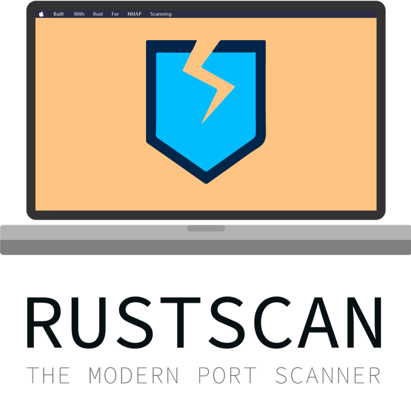

<div align="center">



# RustScanX


**基于 Rust 的现代化高速端口扫描器 —— 以异步并发做端口发现，把深度探测交给 Nmap / 脚本引擎**

[快速开始](#-快速开始) • [使用示例](#-使用示例) • [参数参考](#-命令行参数参考) • [配置文件](#-配置文件) • [核心机制](#-核心机制) • [测试说明](#-测试说明) • [致谢](#-关于与致谢)

</div>

> ⚠️ **合法使用声明**：请勿在未经授权的目标上运行本工具。端口扫描在诸多司法辖区可能违法，使用者须自行承担全部法律责任。本工具仅用于安全研究、授权渗透测试、自有资产自查等合法用途。

---

## 🔱 关于与致谢

**RustScanX 是基于原开源项目 [RustScan](https://github.com/bee-san/RustScan) 二次开发（fork）而来的分支。**

- 原项目地址：<https://github.com/bee-san/RustScan.git>
- 上游文档与 Wiki：<https://github.com/bee-san/RustScan/wiki>

RustScan 由 [Bee (Autumn)](https://skerritt.blog) 与社区共同创造，其"以 Rust 重写更快的 Nmap 前端 + 脚本引擎"的核心思路与大量基础架构均源自原项目。RustScanX 在保留原有设计理念与 **GPL-3.0-only** 许可证的前提下独立维护与改进。我们向 RustScan 的原作者与全体贡献者致以诚挚敬意 🙏。

---

##  项目简介

RustScanX 是一个用 Rust 编写的**端口扫描器**。它的设计目标是：以极高的并发把"发现哪些端口开放"这件事做到最快，再把确定开放的结果**管道（pipe）给 Nmap 或自定义脚本**做深度探测 —— 用异步 I/O 快速完成"连接扫描"这类脏活，把需要复杂协议探测的部分交给成熟的脚本引擎。

###  核心特性

- **极速端口发现**：单个 future 驱动 `FuturesUnordered`，同一时刻维持最多 `batch_size` 个在途连接，可在秒级内扫完 65535 个端口。
- **TCP + UDP 双协议**：TCP 采用带超时/重试的 connect 探测；UDP 使用编译期从 `nmap-payloads` 生成的"端口→有效载荷"表发送真实协议探测包，并通过读取 ICMP "port unreachable"（Linux 上的 `EPOLLERR`）区分"关闭"与"被过滤"。
- **随机化端口顺序**：基于**线性同余生成器（LCG）**，选取与端口总数互质的步长，保证一次遍历所有端口且彼此不相邻，降低被入侵检测系统识别的概率。
- **灵活的地址输入**：字面量 IP、IPv6、CIDR（含非规范化 CIDR，自动对齐到网络地址）、主机名（DNS 解析）、每行一个地址的文件；`-x/--exclude-addresses` 支持按 CIDR/IP/主机名排除目标。
- **DNS 惰性解析**：当目标多为字面量 IP/CIDR 时不初始化解析器，仅在真正需要解析主机名时按需创建，避免拖慢扫描。
- **位图端口排除**：`--exclude-ports` 用一张 8 KiB 的完整 u16 位图在异步轮询帧之外过滤端口，短列表退化为直接成员检查。
- **自适应批量大小**（Unix）：依据进程文件描述符限额（`ulimit`）自动下调批量，避免"打开文件数过多"导致扫描失败。
- **脚本引擎**：按标签（tags）匹配脚本，把开放端口自动管道进 `nmap`，或运行任意语言的自定义脚本。
- **稳健且可无障碍**：`-g/--greppable` 只输出 IP 与端口；`--accessible` 关闭对屏幕阅读器不友好的特性；所有输出经 `println_safe`，管道被提前关闭（`| head` 触发 `BrokenPipe`）时安静退出而非 panic。

###  技术栈

| 分类            | 技术                                                                          |
|-----------------|-------------------------------------------------------------------------------|
| **语言/运行时** | Rust（edition 2018）、Tokio（current-thread 运行时，`rt`/`net`/`time`）       |
| **并发**        | `futures::stream::FuturesUnordered`、`tokio::task::unconstrained`/`yield_now` |
| **CLI/配置**    | clap 4（derive）、toml、serde、dirs                                           |
| **地址解析**    | cidr-utils、hickory-resolver（DNS over Rustls）                               |
| **随机化**      | rand、gcd（LCG 步长互质选择）                                                 |
| **输出/着色**   | colored、colorful、ansi_term、env_logger、anstream                            |
| **系统/进程**   | rlimit、libc（Unix）、windows-sys（Winsock）、text_placeholder（脚本模板）    |
| **构建**        | build.rs（编译期解析 `nmap-payloads` 生成 UDP 有效载荷表）                    |
| **测试/基准**   | 单元与集成测试、criterion 微基准、parameterized                               |

---

##  快速开始

RustScanX 是原项目的二次开发分支，**尚未发布到 crates.io / 各发行版包仓库**，目前请从源码构建。

### 前置要求

- Rust 工具链（`rustup`，含 `cargo`）
- 若要体验默认脚本引擎：系统已安装 `nmap`

### 从源码构建并安装

```bash
git clone https://github.com/bee-san/RustScan.git   # 或本分支对应的仓库地址
cd RustScan
cargo install --path .
```

构建产物二进制名为 **`rustscanx`**。开发调试可直接运行：

```bash
cargo run --release -- -a 127.0.0.1
```

> 原项目 RustScan 亦可通过 `cargo install rustscan` 及各包管理器（Homebrew / pacman / apt 等）安装，参见上游[安装指南](https://github.com/bee-san/RustScan/wiki/Installation-Guide)。

---

##  使用示例

以下参数均取自 `src/input.rs` 中的 `Opts` 定义（`rustscanx --help` 查看完整列表）。

```bash
# 扫描单个主机的常见端口范围
rustscanx -a 127.0.0.1 -r 1-1000

# 指定端口列表
rustscanx -a 127.0.0.1 -p 22,80,443,8080

# 扫描全部 65535 端口（未给 -p/-r 时的默认范围），调整超时与并发
rustscanx -a 192.168.1.0/24 -t 2000 -b 5000

# 随机顺序扫描，并排除某些端口
rustscanx -a example.com --scan-order random --exclude-ports 80,443

# 排除部分目标地址
rustscanx -a 192.168.0.0/16 -x 192.168.1.0/24

# 只输出可 grep 的结果，不运行脚本
rustscanx -a 10.0.0.1 -g --scripts none

# UDP 扫描
rustscanx -a 127.0.0.1 -r 1-1024 --udp

# 慢速、低噪声扫描：每扫完一个端口等待 250ms，并列出主动拒绝的关闭端口
rustscanx -a 127.0.0.1 -r 1-1000 --interval 250 --closed

# 把 `--` 之后的参数透传给脚本引擎（默认会把结果管道进 nmap）
rustscanx -t 1500 -a 127.0.0.1 -- -A -sC
```

---

##  项目结构

```
RustScan/
├── README.md                     # 项目说明（本文件）
├── Cargo.toml / Cargo.lock       # 包与依赖（[[bin]] name = "rustscanx"）
├── build.rs                      # 编译期解析 nmap-payloads，生成 UDP 有效载荷表
├── config.toml                   # 端口→分类数据文件
├── justfile / Makefile           # 构建与打包配方
├── contributing.md               # 贡献指南
├── CODE_OF_CONDUCT.md            # 行为准则
├── src/
│   ├── main.rs                   # CLI 入口：装配 opts、扫描、聚合、运行脚本、基准
│   ├── lib.rs                    # 声明公开模块与输出宏，供库调用者复用
│   ├── input.rs                  # Opts（clap）、Config（TOML）、PortRanges、ScanOrder/ScriptsRequired、合并逻辑
│   ├── address.rs                # IP/IPv6/CIDR/主机名/文件解析、惰性 DNS、目标排除、去重
│   ├── tui.rs                    # println_safe（BrokenPipe 安全）与 warning!/detail!/output!/funny_opening! 宏
│   ├── port_strategy/
│   │   ├── mod.rs                # PortStrategy：Manual / Serial / Random
│   │   └── range_iterator.rs     # LCG 随机顺序 + 串行去重（65536 项 seen 表）
│   ├── scanner/
│   │   ├── mod.rs                # 扫描核心：FuturesUnordered 并发、TCP/UDP 探测、端口过滤、结果聚合
│   │   ├── socket_iterator.rs    # 零分配遍历 (ip, port) 组合，产出 SocketAddr
│   │   └── errors.rs             # 诊断错误收集、去重与描述符耗尽检测
│   ├── scripts/mod.rs            # 脚本引擎：按 tags 匹配、模板替换并执行
│   └── benchmark/mod.rs          # 命名计时器与运行时基准摘要
├── tests/
│   └── udp_payload_lookup.rs     # 集成测试：UDP 有效载荷查找表覆盖常见端口
├── benches/
│   └── benchmark_helpers.rs      # criterion 微基准：端口准备、位图排除、有效载荷查找
├── docs/                         # ARM 支持、惰性 DNS 与端口排除基准报告
└── fixtures/                     # 脚本引擎测试用的样例脚本与配置
```

---

##  命令行参数参考

| 参数 | 默认 | 含义 |
| :--- | :--- | :--- |
| `-a, --addresses` | — | 逗号分隔或文件形式的 CIDR/IP/主机列表 |
| `-p, --ports` | — | 逗号分隔端口列表，如 `80,443,8080`（与 `-r` 互斥） |
| `-r, --range` | 未给 `-p/-r` 时为 `1-65535` | `start-end` 逗号分隔范围，如 `1-500,1000-2500` |
| `-b, --batch-size` | `4500` | 并发批量大小（在途连接上限） |
| `-t, --timeout` | `1500` | 判定端口关闭前的超时毫秒数 |
| `--tries` | `1` | 连接重试次数（为 0 时自动纠正为 1） |
| `--scan-order` | `serial` | `serial`（升序）或 `random`（LCG 随机） |
| `--scripts` | `default` | `none` / `default` / `custom` |
| `--exclude-ports` | — | 排除的端口列表（位图过滤） |
| `-x, --exclude-addresses` | — | 排除的 CIDR/IP/主机列表 |
| `--udp` | `false` | 启用 UDP 扫描 |
| `--closed` | `false` | 额外列出主动拒绝（关闭）的 TCP 端口（不对它们运行脚本） |
| `--interval` | `0` | 每扫完一个端口（在每个地址上）后等待的毫秒数，用于慢扫 |
| `-g, --greppable` | `false` | 只输出 IP 与端口，便于管道/落盘 |
| `--accessible` | `false` | 关闭对屏幕阅读器不友好的输出 |
| `--resolver` | — | 逗号分隔或文件形式的 DNS 解析器列表 |
| `-u, --ulimit` | — | 自动提高 Unix 文件描述符限额（仅 Unix，Windows 会拒绝） |
| `--top` | `false` | 使用配置文件中的 top ports |
| `-n, --no-config` | `false` | 忽略配置文件 |
| `-C, --config-path` | — | 指定配置文件路径 |
| `--no-banner` | `false` | 隐藏开场横幅 |
| `-- <args>` | — | 将 `--` 之后的参数透传给脚本（追加到 call_format 末尾） |

---

##  配置文件

RustScanX 会读取 TOML 配置文件，**命令行显式给出的选项优先于配置文件**（`Opts::merge` 记录了哪些字段来自命令行）。默认按顺序尝试以下路径：

1. `$XDG_CONFIG_HOME/rustscanx/config.toml`（Linux；未设置时回退 `~/.config`），及 macOS / Windows 上平台等价的 `dirs::config_dir()`；
2. 过渡路径 `$XDG_CONFIG_HOME/.rustscan.toml`；
3. 兼容历史版本的家目录 `~/.rustscan.toml`。

也可用 `-C, --config-path` 指定路径，或用 `-n, --no-config` 忽略。

```toml
addresses = ["127.0.0.1"]
range = "1-1000"           # 也支持 { start = 1, end = 1000 } 或 [[1, 1000], ...]
ports = [80, 443, 8080]    # 与 range 互斥
batch_size = 4500
timeout = 1500
tries = 1
scan_order = "Serial"      # 或 "Random"
scripts = "default"        # "none" / "default" / "custom"
greppable = false
exclude_ports = [8080, 9090]
udp = false
closed = false
interval = 0
```

> `range` 会拒绝 `start > end`、空列表与非法 token；`--greppable` 与 `--scripts none` 会跳过脚本运行，只打印结果。

---

##  核心机制

以下梳理基于对 `src/` 全部源码的通读。

### 扫描执行流程

```
命令行 / 配置文件 (Opts::merge，命令行优先)
      ▼
地址解析 parse_addresses —— IP/CIDR/主机名/文件 → 去重 → 移除被排除地址（惰性 DNS）
      ▼
端口顺序 PortStrategy::order() —— serial：按输入顺序去重；random：LCG（步长与总数互质 → 满循环、端口分散）
      ▼
端口过滤 filter_excluded_ports —— 8 KiB u16 位图排除 --exclude-ports（短列表退化为成员检查）
      ▼
SocketIterator —— 零分配遍历 (ip, port) 组合，产出 SocketAddr
      ▼
scan_sockets (current-thread Tokio 运行时) —— 最多 batch_size 个在途；每 WORK_PER_TURN=128 让出一次
      ▼
每个套接字：TCP connect（timeout/tries）｜UDP 按端口取 nmap 有效载荷发送并等待回应/ICMP 错误
      ▼
聚合按 IP 归并 Open / Closed → 脚本引擎运行 → 终端（彩色/无障碍）或 -g 可 grep 结果 + 基准摘要
```

### 关键实现细节

- **让出与并发预算**：扫描用 `tokio::task::unconstrained` 包裹，并在每轮处理 `WORK_PER_TURN`（128）个套接字后 `yield_now`，把运行时 I/O 轮询与定时器触发控制在约 1ms 内，避免一次轮询长时间霸占线程导致超时先于结果触发。
- **LCG 随机化**：`RangeIterator::new_random` 先把（可能重叠的）范围合并归一化并用前缀和映射；步长选取满足 `gcd(step, N) == 1`，保证序列为全长排列，且相邻端口彼此分散。互质候选 10 次不中时回退 `end - 1`。
- **UDP 结果判定**：在目标地址族的未指定地址上绑定非阻塞套接字发送探测；先做一次非阻塞 `recv`（本地回应/ICMP 错误几乎立即可得），仅在需要等待时注册到 Tokio 反应器；`recv_or_error` 同时关注 `READABLE` 与 `ERROR` 就绪事件，从而在 Linux 上正确捕获 ICMP "port unreachable"。
- **有效载荷解析**：`build.rs` 的解码器保留字面文本（如 SNMP 团体名、NetBIOS 名称、LDAP/SSDP 头部），并把跨多行的 `"..."` 片段无分隔拼接，保证探测字节与 Nmap 一致。
- **批量大小自适应（仅 Unix）**：`ulimit` 低于请求批量时按经验下调（小于平均批量 3000 时取半、高于默认 8000 时取 3000，否则 `ulimit-100`）；Windows 直接使用用户请求值，且会拒绝 `--ulimit`。
- **非规范化 CIDR**：`address.rs` 把任何形似 CIDR 的输入按其网络位对齐（如 `192.168.1.13/29` → 覆盖 `.8`–`.15`），避免"看着像 CIDR 却被当主机名解析"。
- **稳健输出**：`println_safe` 在 `BrokenPipe` 时以 0 安静退出；`panic = "abort"` 的 release 配置下避免 `println!` 崩溃。

---

##  脚本引擎

`--scripts` 三种取值（见 `src/scripts/mod.rs`）：

- `default`：运行内嵌默认脚本 —— 把发现的端口以 `nmap -vvv -p {{port}} -{{ipversion}} {{ip}}` 管道进系统 `nmap`。
- `none`：不运行任何脚本，只显示端口扫描结果。
- `custom`：读取 `~/.rustscan_scripts.toml`（可用 `directory` 字段指定脚本目录），按 `tags` 匹配脚本目录下的脚本文件（脚本 `tags` 必须包含配置要求的**全部**标签才会被选中）。

脚本文件以 `#` 注释提供 TOML 元数据（`tags`、`developer`、`port`、`ports_separator`、`call_format`）。`call_format` 中的 `{{script}}`、`{{ip}}`、`{{port}}` 会被替换为脚本完整路径、扫描得到的 IP 与端口；格式不符的脚本会被静默丢弃。示例见 `fixtures/.rustscan_scripts/test_script.txt`。

---

##  测试说明

测试为**无网络、无外部脚本执行**的单元与集成测试，聚焦解析、配置合并、端口排序、套接字迭代、有效载荷解码与错误诊断。运行：

```bash
cargo test                 # 单元 + 集成测试（含 doctest）
cargo test -- --nocapture  # 查看输出
cargo bench                # criterion 微基准（benches/）
```

| 模块                          | 覆盖内容                                                                                                                                                                    |
|:------------------------------|:----------------------------------------------------------------------------------------------------------------------------------------------------------------------------|
| `input.rs`                    | CLI 解析、末尾 `-- command` 透传、range 合法性（含畸形与 legacy table/string/pairs 三种写法）、命令行覆盖配置的合并、`--interval` 解析、平台校验（Windows 拒绝 `--ulimit`） |
| `main.rs`                     | Unix 批量大小自适应（取半 / 平均 / `ulimit-100`）、开场横幅不 panic、Windows 批量保持用户值                                                                                 |
| `address.rs`                  | 字面量/CIDR 解析、非规范化 CIDR（跨八位组）、重复 CIDR、目标排除、惰性 DNS（字面量目标不初始化解析器）                                                                      |
| `port_strategy/`              | Serial/Random 的 range 与 ports 两种来源、`RangeIterator` 的 LCG 覆盖与串行去重（含全 65535 端口）                                                                          |
| `scanner/mod.rs`              | 超时/拒绝的 TCP 判定、`--closed` 行为、流双向 shutdown、描述符耗尽不挂起、不 spawn 任务、future 为 `Send`、interval 逐端口扫描、UDP 有效载荷 last-wins、多 IP/多端口聚合    |
| `scanner/socket_iterator.rs`  | IP×端口顺序、size_hint 精确、Clone 独立续扫、空输入                                                                                                                         |
| `scanner/errors.rs`           | 诊断启用/禁用的格式化与去重、按 OS 错误码检测描述符耗尽                                                                                                                     |
| `scripts/mod.rs`              | 脚本初始化（none/default）、不可读文件跳过不 panic、配置路径解析、`directory` 覆盖家目录回退                                                                                |
| `tests/udp_payload_lookup.rs` | UDP 有效载荷查找表覆盖 DNS(53)/NTP(123) 且非空                                                                                                                              |
| `build.rs`（doc 测试）        | 有效载荷解码：多行 `"..."` 拼接、字面文本保留、CRLF 归一                                                                                                                    |

> 具体测试数量以 `cargo test` 输出为准（不同平台会启用/跳过 `#[cfg(unix)]`/`#[cfg(windows)]` 用例），此处不虚报固定数字。

---

##  常见问题

**1. 没有扫到任何开放端口？**
通常由批量大小过高所致。降低 `-b`（如 `-b 2500`）或提高超时 `-t 2000`（2 秒）。程序会在找不到开放端口时给出提示。

**2. `Too many open files`？**
Unix 上文件描述符限额低于批量。用 `--ulimit 5000` 提高限额，或使用 Docker 镜像；程序也会依据 `ulimit` 自动下调批量。

**3. Windows 上能用 `--ulimit` 吗？**
不能。`--ulimit` 仅支持类 Unix 系统；Windows 请用 `-b/--batch-size` 控制并发，程序会在 Windows 上拒绝该参数。

**4. 扫描会拖慢主机名解析吗？**
多数目标为字面量 IP/CIDR 时不会初始化 DNS 解析器；只有需要解析主机名时才按需创建，避免为纯数字目标读取 hosts / `resolv.conf`。

**5. 管道给 `head` 后报错 panic？**
不会。所有输出经 `println_safe`，`BrokenPipe` 时以退出码 0 安静结束。

---

##  贡献指南

1. Fork 本仓库
2. 创建特性分支：`git checkout -b feature/AmazingFeature`
3. 提交更改：`git commit -m 'Add some AmazingFeature'`
4. 推送分支：`git push origin feature/AmazingFeature`
5. 提交 Pull Request

自动化测试与基准须保持无网络流量、无外部脚本执行；不要添加会实际发起 TCP/UDP 扫描、解析主机名或启动 Nmap 的测试。更多约定见 [`contributing.md`](contributing.md) 与 [`CODE_OF_CONDUCT.md`](CODE_OF_CONDUCT.md)。

---

##  许可证

RustScanX 继承原项目 RustScan 的许可证，采用 **GPL-3.0-only**，详见 [`LICENSE`](LICENSE)。

---

##  再次致谢

RustScanX 的一切可能性都建立在 [RustScan](https://github.com/bee-san/RustScan) 及其贡献者的工作之上。若你需要官方发行、包管理器支持与完整文档，请前往原项目：

> <https://github.com/bee-san/RustScan.git> · Discord：<http://discord.skerritt.blog>

<!--Links-->

[discord]: http://discord.skerritt.blog "原项目 Discord 频道"
